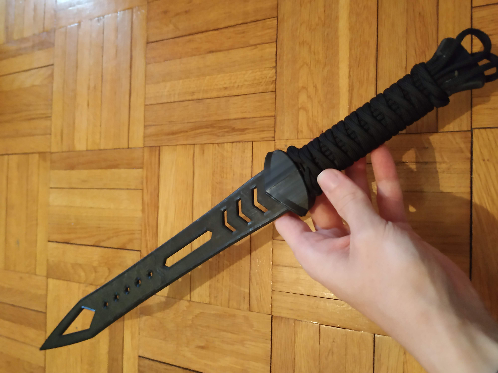
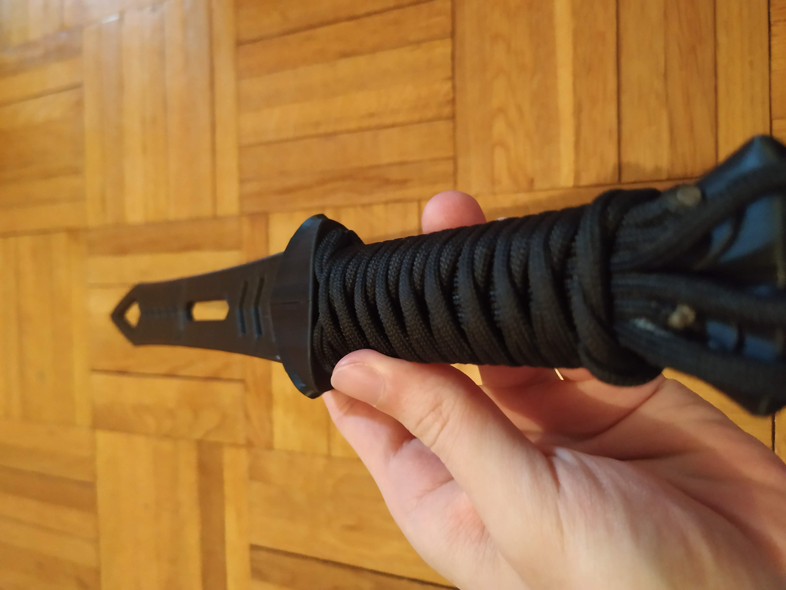
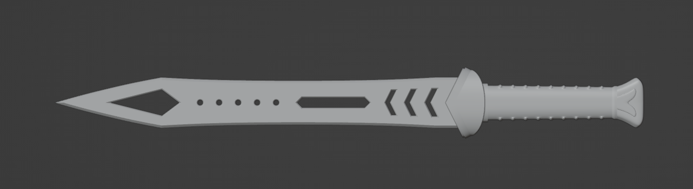
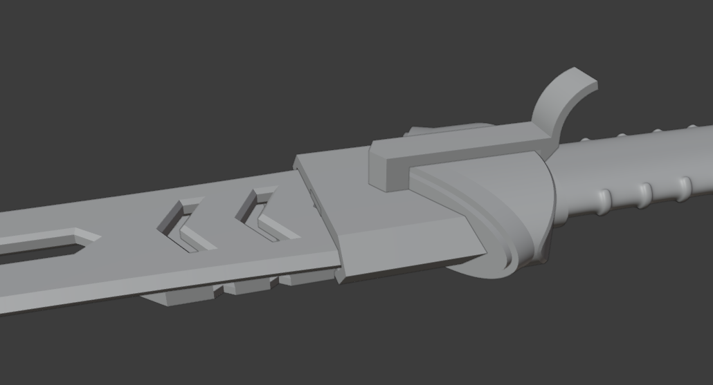

# Assembly

Shouldn't be too hard to make, I used glue on all parts that are supposed to stay together. So far, everything holds nice.

You can sew the Holder onto a strap, or attach it in a different way, I made some extra holes for it.

I used 8 mm paracord to wrap the handle.

# Support me

If you have the means, I would really apprecieate if you could support my work. This helps me make more projects in the future. You can donate at my paypal: [paypal.me/mahrkeenerh](https://www.paypal.me/mahrkeenerh)

# Print settings

I am using a standard Ender 3, with PLA, 200 °C nozzle 60 °C bed.

Nothing needed supports, only the [Holder_out.stl](out/Holder_out.stl) needed a brim, otherwise it didn't stick properly.

Some parts needed to be printed a little smaller to fit properly, or be sanded down a little bit.

# Images

