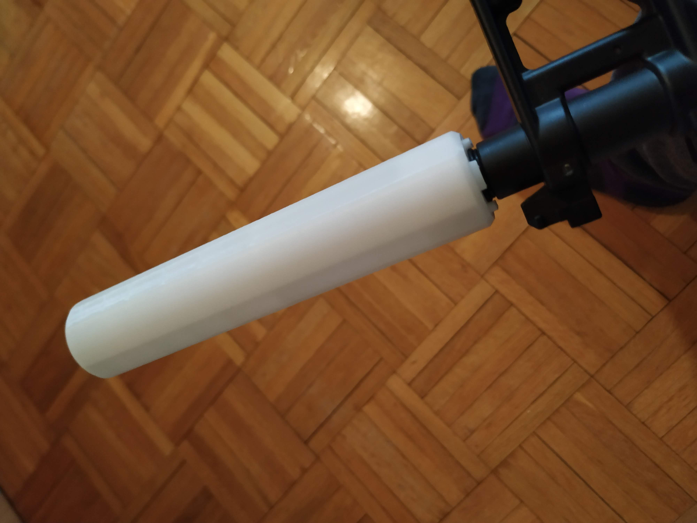
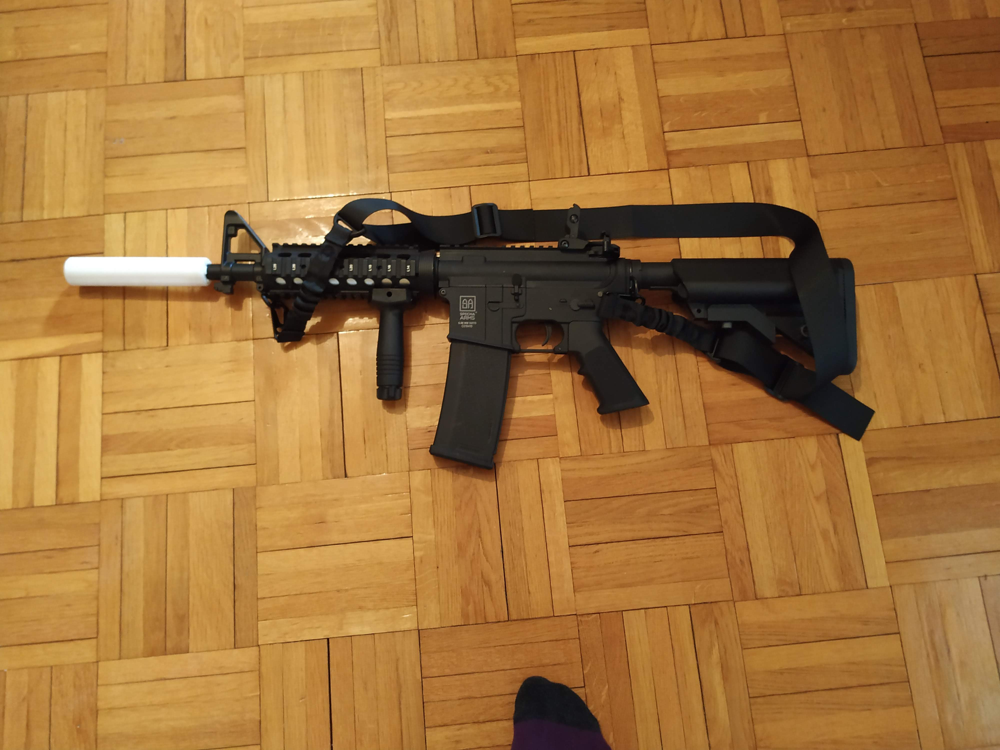
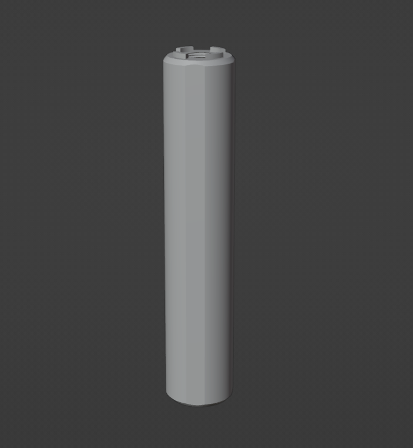
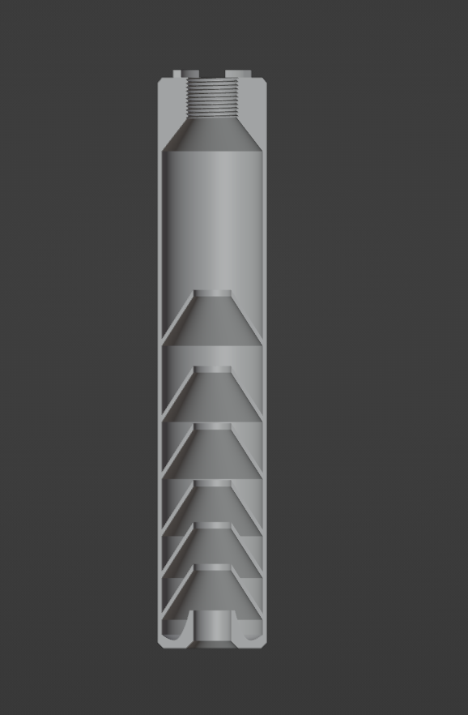
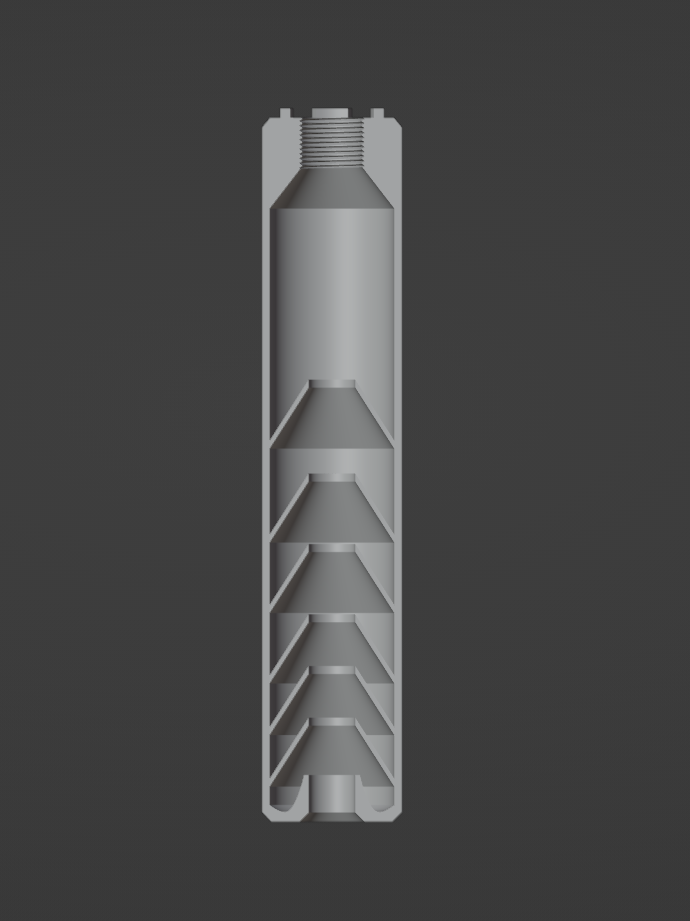

# Warning

Making or even the possession of a silencer may be illegal in your country. Check with your local laws first, I take no responsibility for you.

# Support me

If you have the means, I would really apprecieate if you could support my work. This helps me make more projects in the future. You can donate at my paypal: [paypal.me/mahrkeenerh](https://www.paypal.me/mahrkeenerh)

# Print settings

I am using a standard Ender 3, with PLA, 200 °C nozzle 60 °C bed.

My printer (even-though very well calibrated) didn't like to print a threaded hole. I had to change the size of the [Silencer_v01](out/Silencer_v01.stl) to 102% at XY, and keep it at 100% at Z.

I used variable layer height, so the threaded part was printed at 0.1 mm, but the rest at 0.3 mm, so it didn't take too much time.

The [Silencer_v01](out/Silencer_v01.stl) doesn't require any supports at all, and is all printed in place.

When printed at these settings, the silencer fit very well, and there was no clearance issues whatsoever.

# Images

